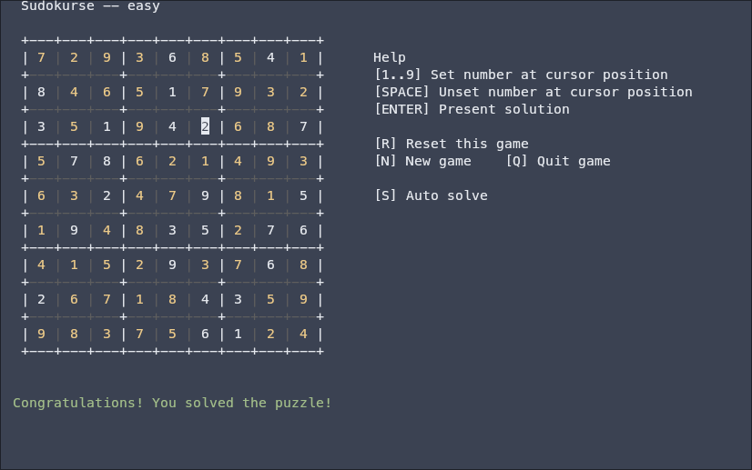

# Sudokurse

Sudoku presented in the terminal via NCurses.

Based on the sudoku generator & solver created by vaithak. See [Sudoku-Generator on GitHub](https://github.com/vaithak/Sudoku-Generator/tree/master).

This presentation is simple and should work in any *nix terminal emulator. This will not work on Windows currently.

You cannot currently choose a difficulty. Each new game generated has a difficulty assigned but you can always generate another to get the difficulty you want.

