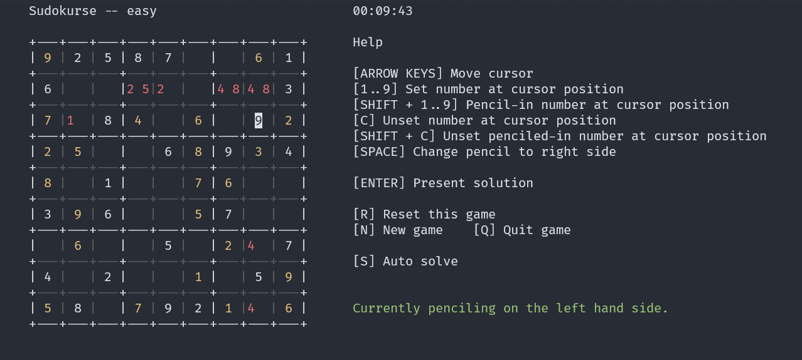

# Sudokurse

Sudoku presented in the terminal via NCurses.

Based on the sudoku generator & solver created by vaithak. See [Sudoku-Generator on GitHub](https://github.com/vaithak/Sudoku-Generator/tree/master).

This presentation is simple and should work in any *nix terminal emulator. This will not work on Windows currently.

You cannot currently choose a difficulty. Each new game generated has a difficulty assigned but you can always generate another to get the difficulty you want.

## Compiling

On a *nix system, you can clone this repository and run `cmake .. && make` in the build directory. This will create the `sudokurse` executable.

## Features

* A stopwatch to time your games. The timer will reset when you start a new game.
* Pencil marks on either side of each cell. Press `SPACE` to toggle between the sides of the cell that the pencil mark should appear, and `SHIFT + 1..9` to pencil in the value.
* An auto-solver to solve the puzzle for you
* A generator to create a new puzzle with random difficulty